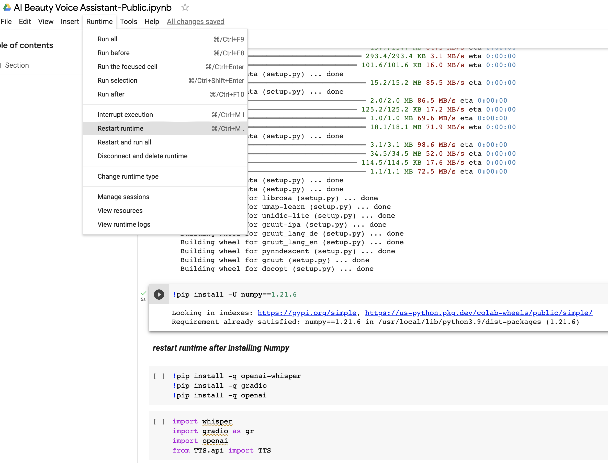
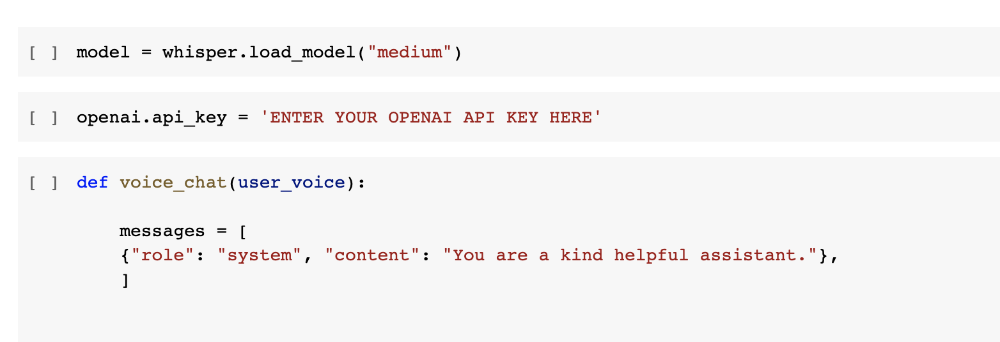
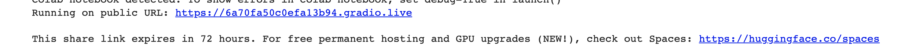
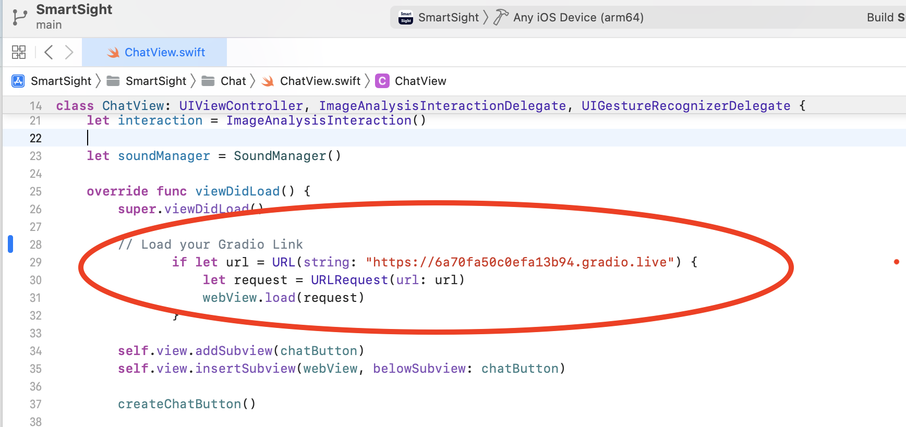

# SmartSightAI

**Note, this project can only be used with a iOS devices with LiDAR such as iPhone 12 and above \_**

This project was built for the Estee Lauder Companies Accessible Beauty Hackathon.

# Product Overview

## Product Demo

[](https://youtu.be/iNHpQZpbA90)

## Product Screenshots

# Tech Stack

- Devices [iOS](https://www.apple.com/ios/ios-16/)
- iOS Framework: [SwiftUI](https://developer.apple.com/xcode/swiftui/)
- Mobile Framework: [UIKit](https://getuikit.com/)
- Speech to text: [Whisper](https://openai.com/research/whisper)
- Text to Speech: [Coqui.ai](https://coqui.ai/)
- Text to Text Chat: [Chat GPT](https://openai.com/blog/chatgpt)
- Voice Interaction: [Siri Kit](https://developer.apple.com/documentation/sirikit)
- AI Execution layer [Google Colaboratory](https://colab.research.google.com/)
- AI Hosting [Gradio](https://gradio.app/o)
- In app CPU: [Accelerate](https://developer.apple.com/documentation/accelerate)
- In app GPU [Metal](https://developer.apple.com/documentation/metal/)
- App functionality [Foundation](https://developer.apple.com/documentation/foundation)
- Audio & Video [AVFoundation](https://developer.apple.com/av-foundation/)
- Augmented Reality [ARKit](https://developer.apple.com/augmented-reality/arkit/)
- Numerical programming library [NumPy](https://numpy.org/)
- AI Programming Language [Python](https://www.python.org//)

# Quick Start

## AI Beauty Chat Assistant

1. Open the SmartSightAI Google Colab notebook here: [AI Beauty Chat Assistant](https://colab.research.google.com/drive/15nTvcpwRKm52d7zd9fwytNLlyuuZFCu0?usp=sharing)

2. Click on the File > Save Copy in Drive" to save my work into your google drive.

3. Click on the "Runtime" > "Change Runtime Type" and select "GPU" as the hardware accelerator.

4. Run the first 2 notebook cells to Install TTS and NumPy1.21.

5. Restart runtime after installing Numpy 

6. Continue running the notebook cells until you get to the "Open AI Key" section.

7. Get an Open AI API key here: https://beta.openai.com/account/api-keys

8. Enter your Open AI API key here. 

9. Run the notebook cells until you get to the end of the notebook and copy the gradio live link to use inside the SmartSightAI app. 

## SmartSight AI

1. Download github repo

```
git clone https://github.com/markobonna/smartsightai.git
```

2. cd to the root of the project

```
cd /path/smartsightai/SmartSightAI
```

3. Use Xcode to Open The file "SmartSight.xcodeproj"

4. Add your Gradio Live weblink to the ChatView.swift file 

5. Update the info under Signing & Capabilities to match your apple developer profile

6. Attached your Iphone (with LiDar), Select and build the app on your phone

## SmartSightWishlist

Download github repo

```
git clone https://github.com/markobonna/smartsightai.git
```

cd to the root of the project

```
cd /path/smartsightai/SmartSightWishlist
```

Use Xcode to Open The file "SmartSightWishlist.xcodeproj"

Update the info under Signing & Capabilities to match your apple developer profile

Open app in any ipone simulator through Xcode
